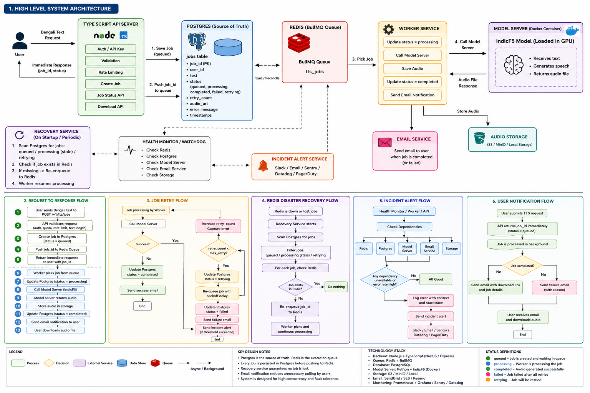
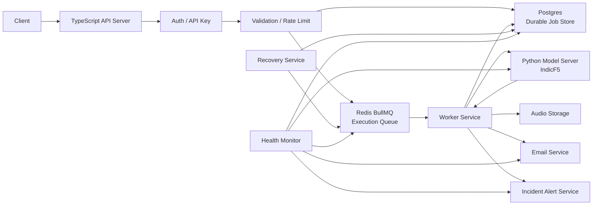
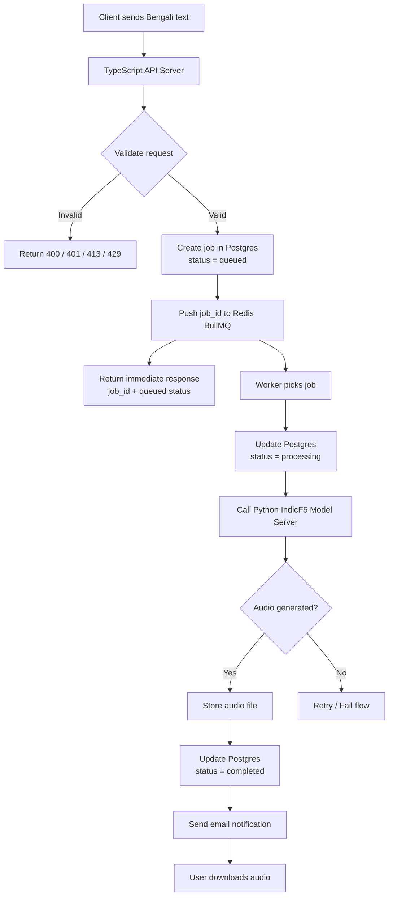
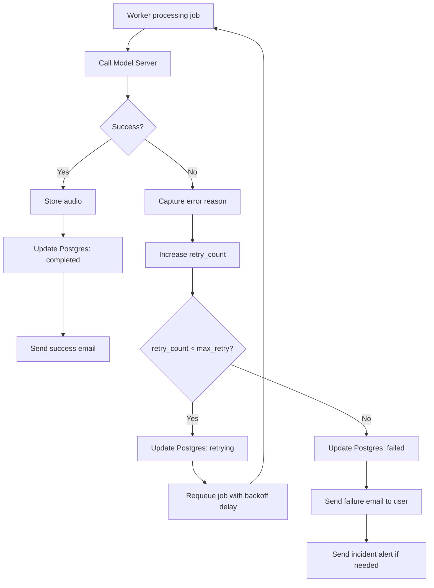
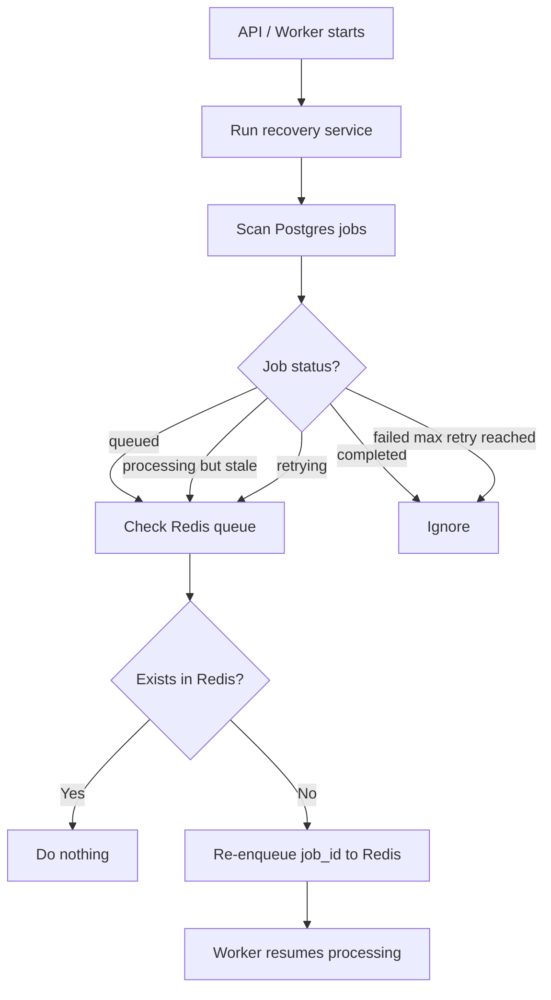
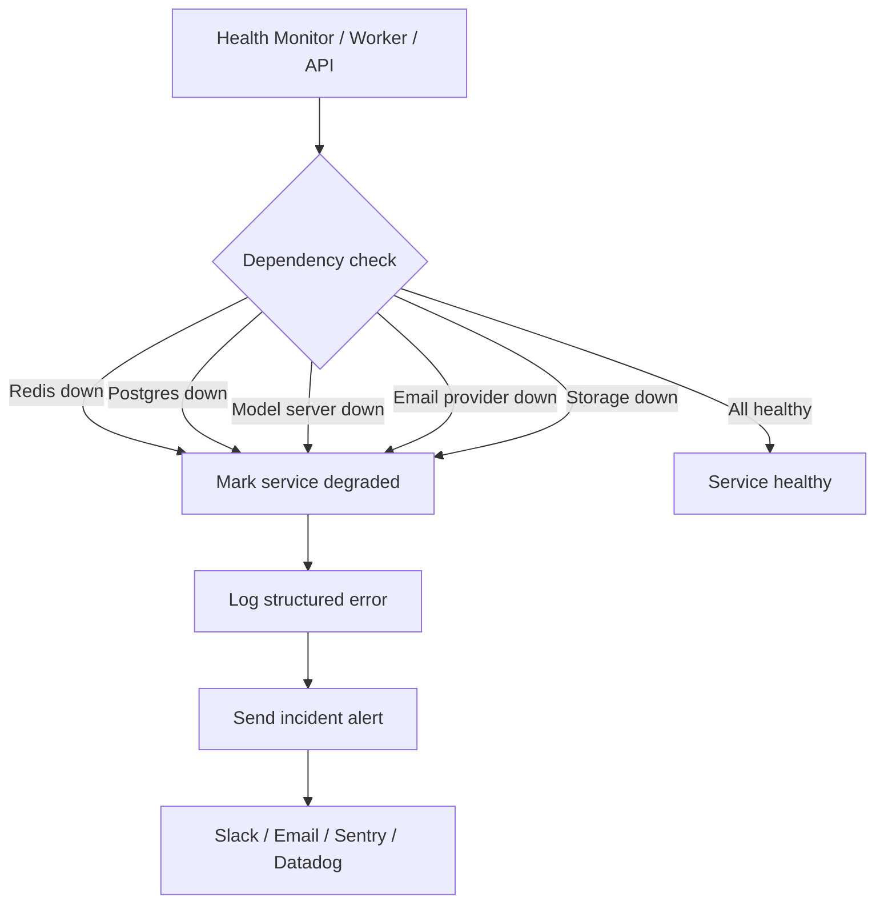
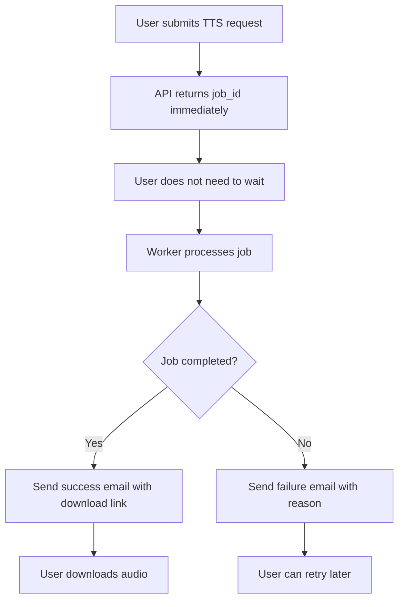

# Bengali TTS Platform (IndicF5)

A production-minded backend that wraps the GPU-bound **IndicF5** text-to-speech
model behind an **asynchronous, multi-user API**. A client submits Bengali text,
the service queues the work, a worker runs inference on a separate model server,
stores the audio, notifies the user, and the client downloads a playable WAV.

Wrapping the model is the easy part — the design goal here is staying
**responsive and correct under concurrent, multi-user load**. Deep rationale in
**[docs/DECISIONS.md](docs/DECISIONS.md)**.

---

## Table of contents

- [System architecture](#system-architecture)
- [How it maps to the brief](#how-it-maps-to-the-brief)
- [Request → response flow](#request--response-flow)
- [Job status lifecycle](#job-status-lifecycle)
- [API reference](#api-reference)
- [How to run (local, one command)](#how-to-run-local-one-command)
- [How to test the API](#how-to-test-the-api)
- [Concurrency, backpressure & scaling](#concurrency-backpressure--scaling)
- [Retry & failure handling](#retry--failure-handling)
- [Durability & Redis disaster recovery](#durability--redis-disaster-recovery)
- [Incident alerting](#incident-alerting)
- [Health checks](#health-checks)
- [User notification](#user-notification)
- [Why this design](#why-this-design)
- [Configuration & docs](#configuration--docs)

---

## System architecture



Two services, deliberately separate so the heavy Python/GPU runtime scales
independently of the lightweight API/worker:

| Service | Stack | Responsibility |
|---|---|---|
| [`tts-api-service`](tts-api-service) | TypeScript (Node 22 LTS) | Public API, auth, per-user isolation, Postgres (source of truth), BullMQ queue, worker, recovery, notifications, alerts, health |
| [`indicf5-model-server`](indicf5-model-server) | Python / FastAPI | Loads IndicF5 once, synthesizes WAV, internal-only (`X-Internal-Token`) |



**Core principle:** Postgres is the durable **source of truth**; Redis/BullMQ is
only the **execution queue**. The API never loads the model, so it stays
responsive no matter how slow inference is.

---

## How it maps to the brief

| Requirement | Where it lives |
|---|---|
| Wrap IndicF5; Bengali text → playable audio | `POST /v1/tts/jobs` → `GET /v1/tts/jobs/:id/audio` |
| Auth / API keys | `src/auth/*` — hashed keys, `Authorization: Bearer` |
| Per-user isolation | `src/jobs/*` — ownership-checked reads/downloads (403/404) |
| Job/worker pattern (submit → poll) | `src/queue/*`, `src/workers/*` — BullMQ; API returns `202` |
| Backpressure / timeouts / rate limiting | per-user rate + pending cap (`429`), global cap (`503`), job/model timeouts (`504`) |
| Robustness | Zod validation, centralized error handler, classified retries, stale-job recovery |
| Explain trade-offs | [docs/DECISIONS.md](docs/DECISIONS.md) |

---

## Request → response flow



1. User sends Bengali text to `POST /v1/tts/jobs`.
2. API validates: API key → Bengali text → text length → monthly quota → rate limit.
3. API creates a job in Postgres (`status = queued`).
4. API pushes `job_id` to the Redis/BullMQ queue.
5. API immediately returns `job_id`, `status = queued`, and a message.
6. Worker picks the job from Redis.
7. Worker updates Postgres (`status = processing`, `started_at = now()`).
8. Worker calls the internal IndicF5 model server (`X-Internal-Token`).
9. Model server generates the audio.
10. Worker stores the WAV in object storage.
11. Worker updates Postgres (`status = completed`, `audio_url`, `completed_at`).
12. Worker sends the completion email (and logs a completion line in dev).
13. User downloads via `GET /v1/tts/jobs/{job_id}/audio`.

---

## Job status lifecycle

```text
queued → processing → completed
                └────→ retrying → processing (bounded retries)
                └────→ failed | timeout   (terminal)
```

| Status | Meaning |
|---|---|
| `queued` | created and waiting in the queue |
| `processing` | worker is running inference |
| `retrying` | attempt failed; will be retried with backoff |
| `completed` | audio generated and stored |
| `failed` | failed after all retries (or non-retryable error) |
| `timeout` | model/job exceeded its time budget |

---

## API reference

Base URL: `http://localhost:3000` · All `/v1/tts/*` routes require
`Authorization: Bearer <api_key>`.

### `POST /v1/tts/jobs` — submit a job

```json
{ "text": "আপনার অডিও তৈরি হচ্ছে।" }
```

`202 Accepted`:

```json
{ "job_id": "…", "status": "queued", "message": "…email when ready." }
```

### `GET /v1/tts/jobs` — list your jobs

`200` → `{ "items": [ { "job_id", "status", "created_at", "completed_at?" } ], "next_cursor": null }`

### `GET /v1/tts/jobs/:jobId` — job status

`200` (completed):

```json
{ "job_id":"…","status":"completed","audio_url":"…","duration_ms":4200,"created_at":"…","completed_at":"…" }
```

`200` (failed): includes `error_code` + a safe `error_message`.

### `GET /v1/tts/jobs/:jobId/audio` — download WAV

Streams `audio/wav` after an ownership check.

### `GET /health` · `GET /health/dependencies`

Liveness, and per-dependency health (see [Health checks](#health-checks)).

### Status codes

| Code | When |
|---|---|
| `202` | job accepted (queued) |
| `400` | empty / non-Bengali / invalid payload |
| `401` | missing / invalid API key |
| `403` | accessing another user's job |
| `404` | job not found / no audio yet |
| `413` | text exceeds `MAX_TEXT_LENGTH` |
| `429` | rate limit / too many pending jobs |
| `503` | global queue full |
| `504` | model timeout |

Full contracts: [public API](tts-api-service/docs/API_CONTRACT.md) ·
[internal model API](indicf5-model-server/docs/API_CONTRACT.md).

---

## How to run (local, one command)

**Prerequisites:** Docker + Docker Compose; a Hugging Face token with access to
the gated [`ai4bharat/IndicF5`](https://huggingface.co/ai4bharat/IndicF5) model;
a reference voice clip. Postgres, Redis, object storage (MinIO) and SMTP
(MailHog) all run as containers.

```bash
cd ass-sunnah
cp .env.example .env
```

Set at least these in `.env`:

```bash
API_KEY_PEPPER=<any-random-secret>
MODEL_SERVER_INTERNAL_TOKEN=<any-random-secret>
HF_TOKEN=<your-huggingface-read-token>     # IndicF5 is a gated model
REFERENCE_TEXT=<exact transcript of your reference clip>
```

Add a reference voice (IndicF5 clones a voice; reference language is independent
of the output language). A short, clean, mono WAV (~5–15s):

```bash
# your own clip, or an official sample:
curl -L "https://github.com/AI4Bharat/IndicF5/raw/refs/heads/main/prompts/MAR_F_WIKI_00001.wav" \
  -o indicf5-model-server/reference/voice.wav
# then set REFERENCE_TEXT in .env to that clip's transcript.
```

Bring up the whole stack and create a user:

```bash
docker compose up -d --build          # migrate runs automatically; model weights download on first boot
docker compose run --rm migrate npx tsx prisma/seed.ts   # prints an API key — copy it
```

Ports: API `:3000` · model server `:8000` · MinIO console `:9001` · MailHog UI `:8025`.

> First model-server boot downloads multi-GB IndicF5 weights; on CPU (e.g. a
> Mac) inference is slow — a demo constraint, not a design limit. Production
> targets GPU (`MODEL_DEVICE=cuda`). See [Scaling](#concurrency-backpressure--scaling).

---

## How to test the API

```bash
export BASE=http://localhost:3000
export API_KEY=ttsk_...               # from the seed output

# auth must fail without a valid key
curl -s -o /dev/null -w "%{http_code}\n" $BASE/v1/tts/jobs                       # 401

# submit a job
export JOB_ID=$(curl -s -X POST $BASE/v1/tts/jobs \
  -H "Authorization: Bearer $API_KEY" -H "Content-Type: application/json" \
  -d '{"text":"আপনার অডিও তৈরি হয়ে গেছে।"}' | jq -r .job_id)

# poll until "completed" (watch the worker log for the completion line)
curl -s $BASE/v1/tts/jobs/$JOB_ID -H "Authorization: Bearer $API_KEY"

# download the audio
curl -sL $BASE/v1/tts/jobs/$JOB_ID/audio -H "Authorization: Bearer $API_KEY" -o out.wav

# input validation
curl -s -o /dev/null -w "%{http_code}\n" -X POST $BASE/v1/tts/jobs \
  -H "Authorization: Bearer $API_KEY" -H "Content-Type: application/json" -d '{"text":""}'      # 400
```

**Per-user isolation:**

```bash
docker compose run --rm migrate npx tsx prisma/seed.ts   # second user
export API_KEY_B=ttsk_...
curl -s -o /dev/null -w "%{http_code}\n" $BASE/v1/tts/jobs/$JOB_ID -H "Authorization: Bearer $API_KEY_B"  # 403
```

**Watch it work:** `docker compose logs -f worker` (prints
`✅ Job <id> completed — download: …`), MailHog UI (http://localhost:8025) for
the email, MinIO console (http://localhost:9001, bucket `tts-audio`) for the WAV.

**Unit tests:** `cd tts-api-service && npm ci && npm run typecheck && npm test`.

---

## Concurrency, backpressure & scaling

TTS inference is slow and GPU-bound, so the API never runs it inline. Load is
handled at several layers:

**Backpressure (shed load before the backlog grows):**

```text
too many requests (per user)     → 429 Too Many Requests
too many pending jobs (per user) → 429 Too Many Pending Jobs
global queue full                → 503 Service Busy
text too large                   → 413 Payload Too Large
```

**Scaling:**

- API stays responsive by construction (inference-free; only enqueues/reads).
- Workers are stateless and share the queue — scale out directly:
  ```bash
  docker compose up -d --scale worker=3
  ```
- The model server is the throughput unit (inference serialized per process).
  Add replicas; workers reach them via the service name (Docker DNS
  round-robins). Remove the debug host `ports:` on `model-server` first
  (replicas can't share host port 8000), then `--scale model-server=2`.
- GPU: build the model image against a CUDA base + CUDA torch and set
  `MODEL_DEVICE=cuda`; autoscale replicas on queue depth (KEDA/HPA).

Details & trade-offs: [docs/DECISIONS.md §4–5](docs/DECISIONS.md).

---

## Retry & failure handling



- Errors are **classified**: retryable (model timeout, network, model 5xx) vs.
  non-retryable (bad input, bad internal token). Non-retryable fails immediately.
- Retries use **BullMQ backoff** — configurable via env (`QUEUE_BACKOFF_TYPE`,
  `QUEUE_BACKOFF_DELAY_MS`; default exponential, 5s base), up to
  `QUEUE_MAX_ATTEMPTS` (default 3).
- After the final attempt: mark `failed`/`timeout`, store a safe reason, send a
  failure email, and raise an incident alert on dependency failure / abnormal
  failure rate.

---

## Durability & Redis disaster recovery

Postgres is authoritative; Redis is disposable. If Redis crashes or loses jobs,
the recovery service (startup + periodic) restores them.



**Recovery rules:**

```text
Postgres queued        + missing from Redis        → re-enqueue
Postgres processing    + stale beyond timeout      → re-enqueue
Postgres retrying                                  → re-enqueue (if missing)
Postgres completed                                 → never touched
Postgres failed        + retry_count < max_retry   → re-enqueue
Postgres failed        + retry_count >= max_retry  → do nothing
```

**Postgres ↔ Redis reconciliation:** Postgres is the source of truth; the worker
writes each status transition to it. Recovery is idempotent — it checks the
BullMQ job state and removes finished artifacts before re-adding, and a job that
Postgres marks `completed` is never reprocessed (the worker early-returns if it
reloads a completed record). The `jobId == db id` de-dupe prevents duplicates.

---

## Incident alerting



Monitored: Redis, Postgres, model server, email provider, audio storage.
Triggers include dependency unavailability, high model-failure rate, queue
backlog, and stuck jobs. Alerts are de-duplicated by fingerprint and fan out to
a Slack webhook and a structured log/Sentry/Datadog sink.

---

## Health checks

```bash
GET /health                 # basic API liveness
GET /health/dependencies    # per-dependency status
```

Checks Postgres ping, Redis ping, model server `/health`, email provider, and
storage. Example (`503` when degraded):

```json
{
  "status": "degraded",
  "dependencies": {
    "postgres": "ok",
    "redis": "ok",
    "model_server": "down",
    "email": "ok",
    "storage": "ok"
  }
}
```

When a critical dependency is down, the service sheds new jobs (`503`) and raises
an alert.

---

## User notification



On completion the worker emails the user a download link (and logs
`✅ Job <id> completed — download: …` for dev visibility); on final failure it
emails a safe reason. In local dev, emails are captured by MailHog
(http://localhost:8025). Notifications reduce polling while polling remains a
fallback.

---

## Why this design

Audio generation never happens inside the request/response cycle, so the API
stays responsive under concurrent load. The TypeScript API owns auth, validation,
user isolation, job tracking, and downloads; the Python server owns only IndicF5
inference. Postgres protects against Redis data loss; Redis/BullMQ bounds
concurrency and prevents GPU overload; email cuts unnecessary polling.

Full reasoning, alternatives, and trade-offs: **[docs/DECISIONS.md](docs/DECISIONS.md)**.

---

## Configuration & docs

- Env reference: [tts-api-service/docs/ENVIRONMENT.md](tts-api-service/docs/ENVIRONMENT.md)
- Design & trade-offs: [docs/DECISIONS.md](docs/DECISIONS.md)
- Architecture & ops: [tts-api-service/docs/ARCHITECTURE.md](tts-api-service/docs/ARCHITECTURE.md)
- Public / internal API contracts: [public](tts-api-service/docs/API_CONTRACT.md) · [internal](indicf5-model-server/docs/API_CONTRACT.md)

### Beyond the brief (production hardening)

Email notifications, incident alerting, and Redis disaster recovery are included
to demonstrate production thinking; they're isolated and not required by the task.

### Infra assumptions

Local dev runs entirely in Docker (managed Postgres/Redis also supported via
`DATABASE_URL`/`REDIS_URL`). Redis must allow blocking commands and use
`maxmemory-policy noeviction` (set here) for BullMQ. Object storage is
S3-compatible (MinIO locally). The model server targets GPU in production and
scales horizontally; local runs default to CPU.
